# dAIshboard 
## Table of Content
1. [Introduction](#introduction)
    a. [Business Use Case](#bc)
    b. [Product Introduction](#pi)
2. [Installation](#installation)
    a. [Node](#node)
    b. [Yarn](#yarn)
    c. [Vite](#vite)
    d. [Python](#python)
    e. [Flask](#flask)
3. [Usage](#usage)
    a. [Start](#start)
    b. [Create a User and Login](#user)
    c. [Create a Project](#project)
    d. [Create a Plot](#create)
    e. [Modify a Plot](#modify)
    f. [Delete a Plot](#delete)
4. [Future Work](#fw)

## Introduction <a name="introduction"></a>
### <U>Business Use Case</u><a name="bc"></a>
In the world of business there is always a huge and consistent demand to analyze data. This data can be anything ranging from sales data to employee performance or inventory information.<br/>
This is information is usually stored as a csv or excel file or stored in a relational database like SQL, Postgress etc. <br/>
Almost all the usual methods of storage saves the data as tabular data which is very useful and efficient for saving large amounts of data but is not very friendly when it comes to visualizing this data and gaining meaningful insights from it.
### Product Introduction<a name="pi"></a>
Humans have always been visual creatures. We are able to learn faster and solve problems more efficiently when we are able to visualize the problem in our head or on our screen. The problem here is that visualizing a problem or a dataset keeps getting harder and harder as the size and complexity of the data keeps increasing.<br/>

The tool we have developed solves this problem by allowing the user to generate plots from complex data using natural language. We hope that this tool will help business leaders to take informed decisions based on data and metrics.

## Installation <a name="installation"></a>
This tool is a webapp that runs react typescript for the front end and python flask for the backend. Please follow the steps below to install all the software required to run this locally. Note that the app can be hosted on a server if needed and accessed remotely via the browser.

The installation commands are for Linux Operating System please change according to your OS
### Node<a name="node"></a>
#### Install NVM
<font size="2">**Download and Install NVM:**</font>
```curl -o- https://raw.githubusercontent.com/nvm-sh/nvm/v0.40.1/install.sh | bash```

<font size="2">**Add NVM to bash profile**</font>
```export NVM_DIR="$([ -z "${XDG_CONFIG_HOME-}" ] && printf %s "${HOME}/.nvm" || printf %s "${XDG_CONFIG_HOME}/nvm")"
[ -s "$NVM_DIR/nvm.sh" ] && \. "$NVM_DIR/nvm.sh" # This loads nvm
```

<font size="2">**Install Node:**</font>
```nvm install 20.17.0```

<font size="2">**Use correct version of Node:**</font>
```nvm use 20.17.0```

### Yarn<a name="yarn"></a>
<font size="2">**Install Yarn:**</font>
```npm install --global yarn```

### Vite<a name="vite"></a>
<font size="2">**Install Vite:**</font>
```npm i vite```

### Python<a name="python"></a>
<font size="2">**Install Python:**</font>
```
sudo add-apt-repository ppa:deadsnakes/ppa
sudo apt update
sudo apt install python3.11
```

### Flask<a name="flask"></a>
<font size="2">**Install Flask:**</font>
```
cd dAIshboard/api
pip install -r requirements.txt
```

## Usage<a name="usage"></a>
To use the app we need to start the frontend and the backend

### Start<a name="start"></a>
<font size="2">**Start Frontend:**</font>
```
cd dAIshboard
yarn
yarn dev
```
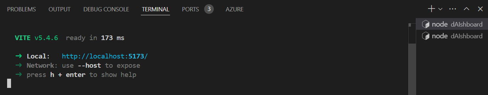

<font size="2">**Start Backend:**</font>
<font size="1">*In a new terminal</font>
```
cd dAIshboard
yarn start-api
```
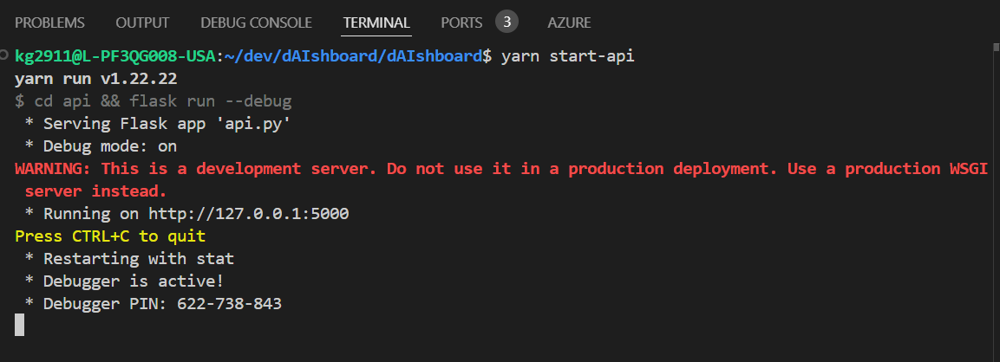

### Create User and Login<a name="user"></a>
<font size="2">1. Go to the homepage</font>
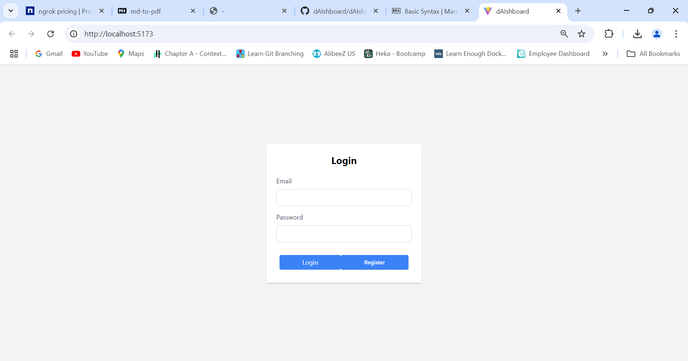

<font size="2">2. Click On Register</font>
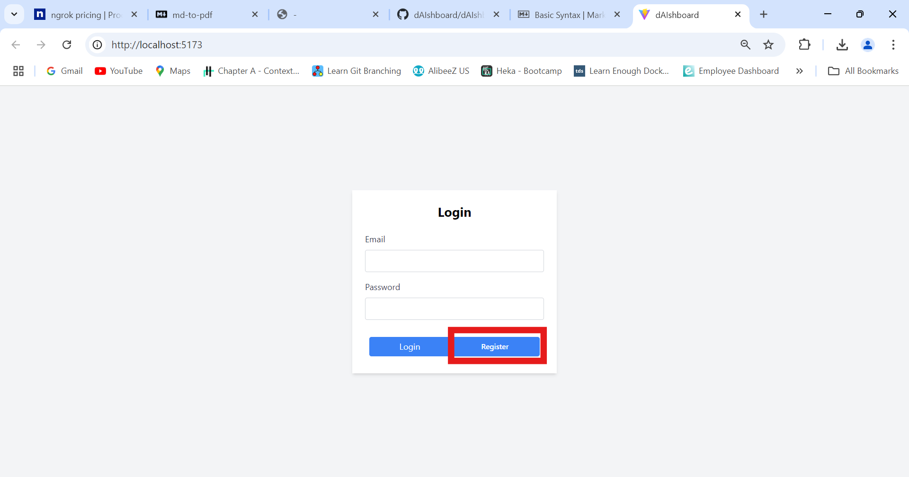

<font size="2">3. Fill the form and submit</font>
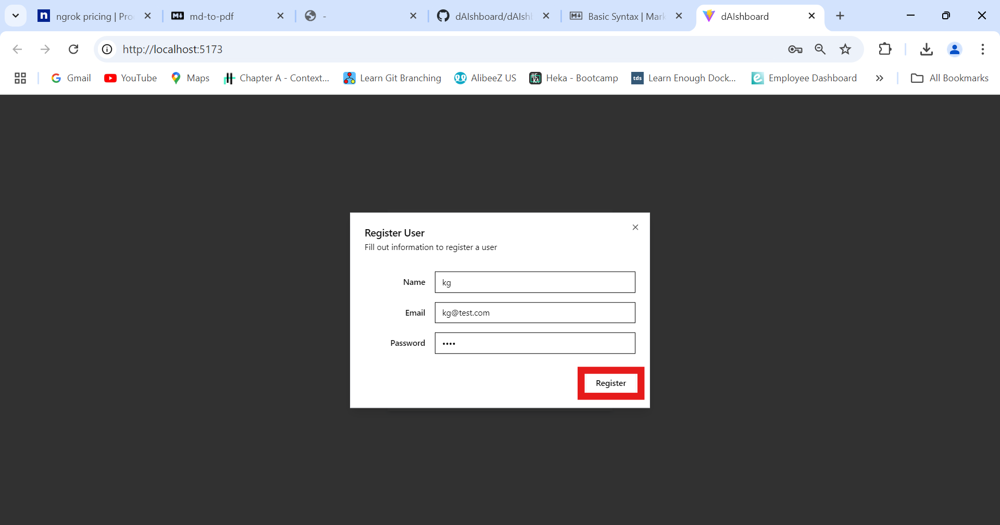

<font size="2">4. Enter the login details and click login</font>
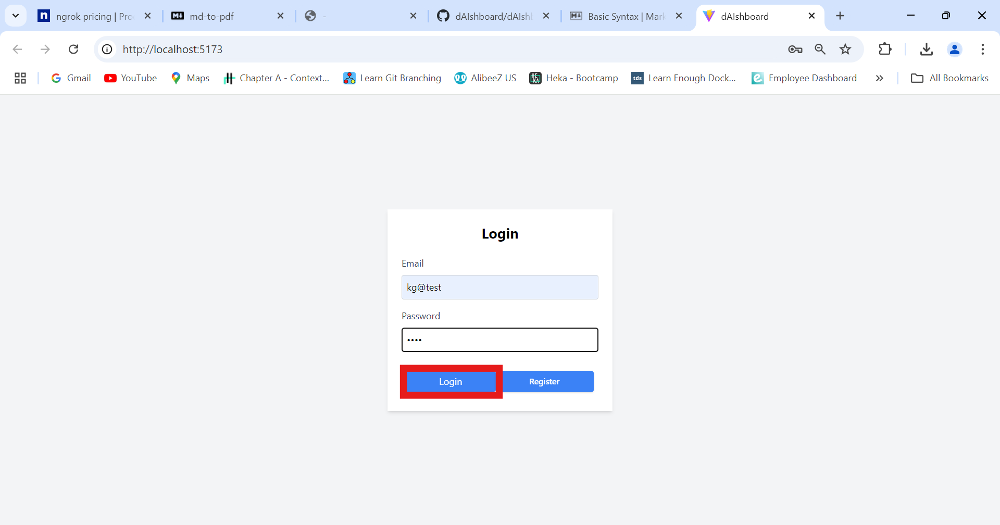

### Create a Project<a name="project"></a>
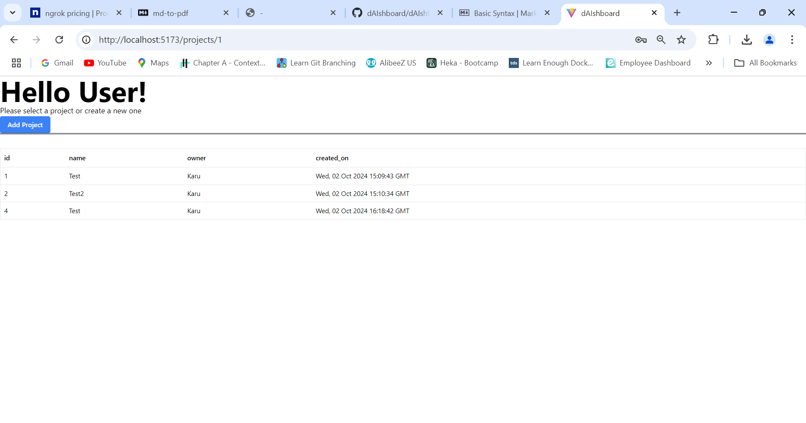
<font size="2">1. Click on Add Project</font>
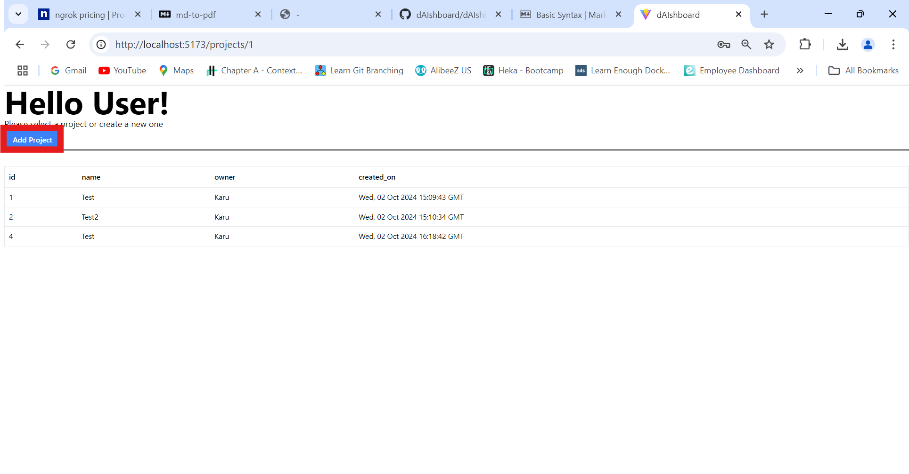
<font size="2">2. Fill form and submit</font>
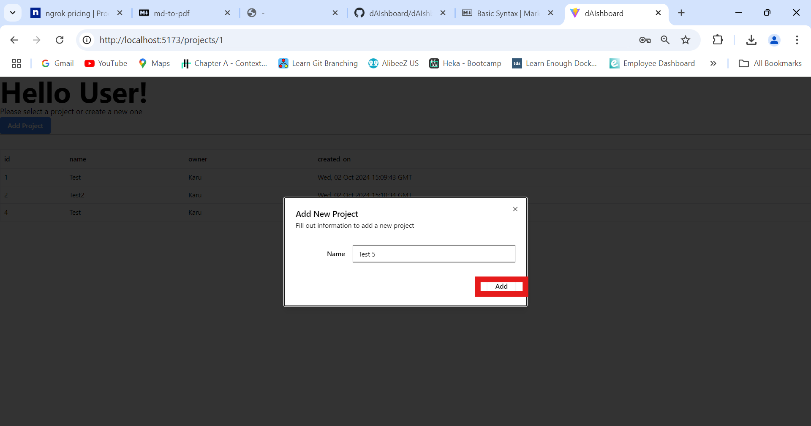
<font size="2">3. To open the project click on the 'id' of the project</font>
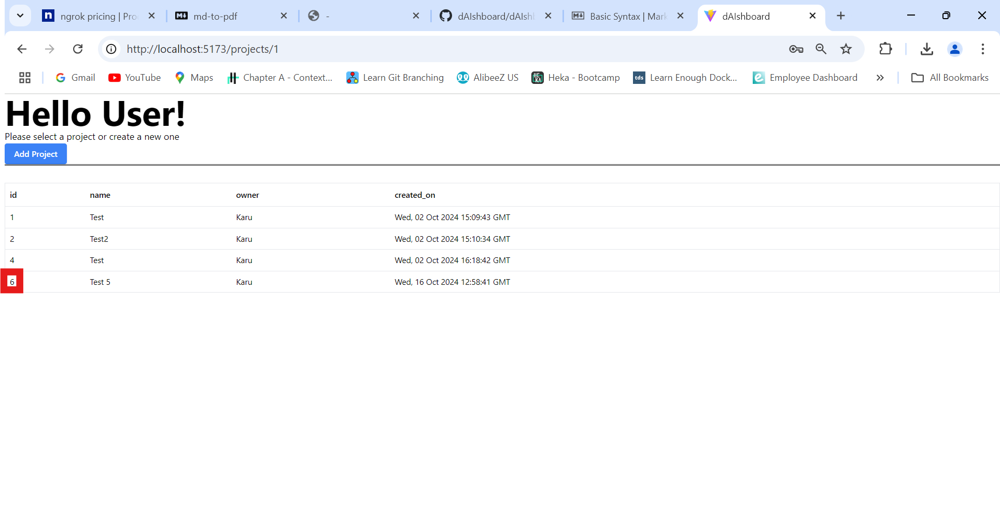

### Upload Data<a name="data"></a>
<font size="2">1. Click on Menu</font>
<font size="2">2. Upload the data (only .xlsx or .csv files)</font>


### Create a plot<a name="create"></a>
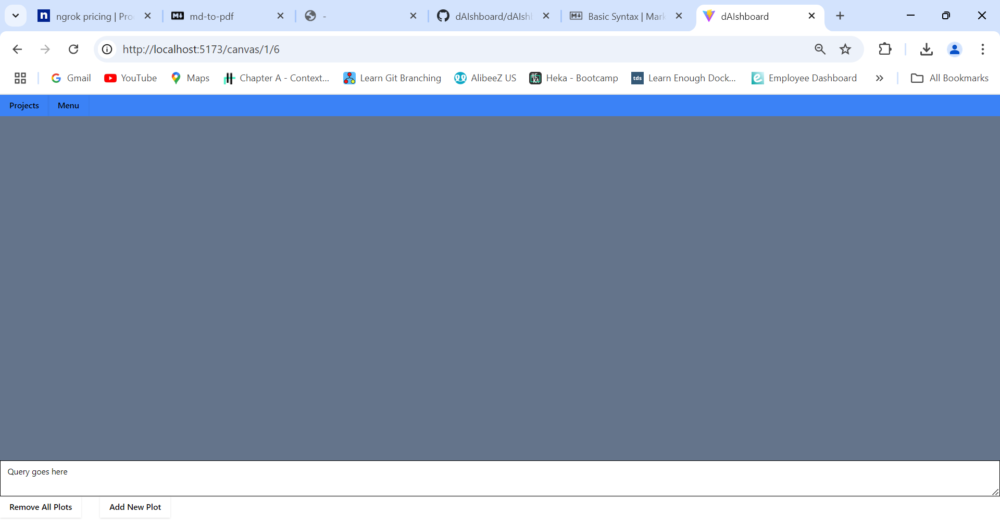
<font size="2">1. Enter the query in the chatarea at the bottom of the project screen</font>
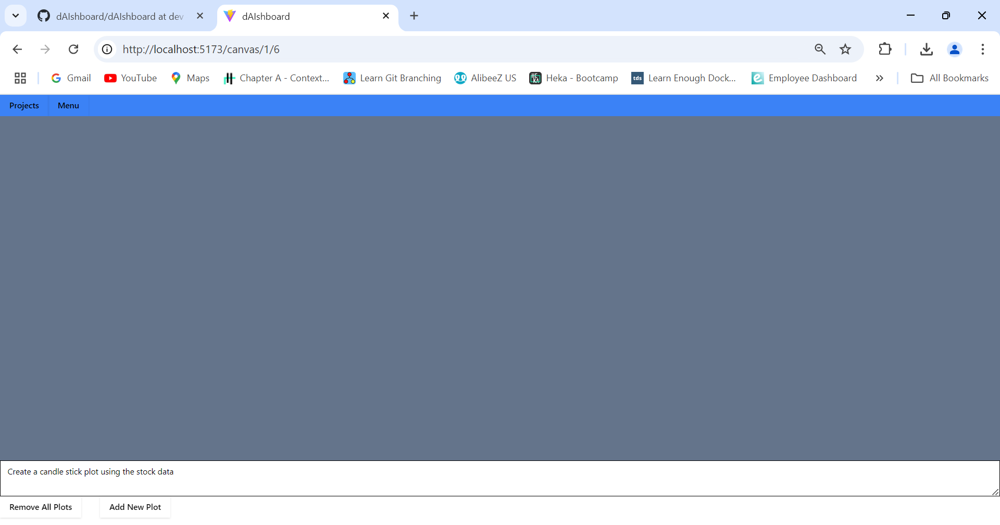
<font size="2">2. Press Enter or click on Add Plot to create a plot using the query you entered</font>
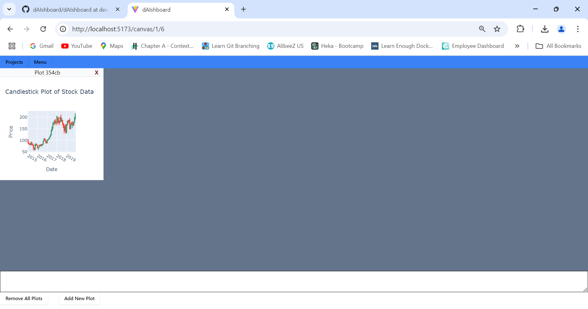

### Modify a plot<a name="modify"></a>
<font size="2">1. Note the plot id at the top of the plot</font>
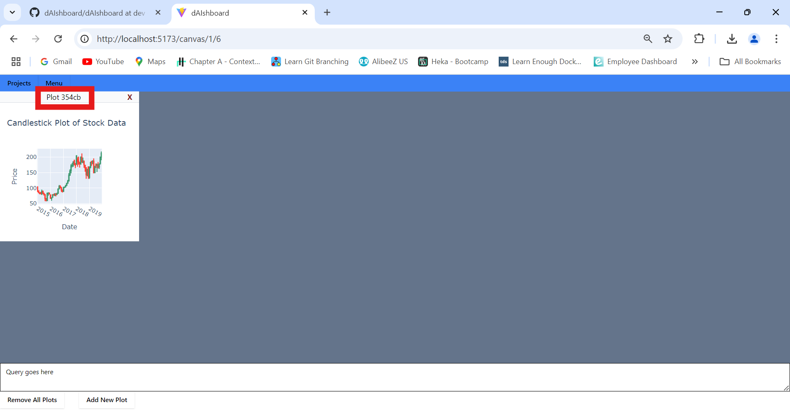

<font size="2">2. Enter a query using the plot id to modfiy the plot</font>


### Delete a plot<a name="delete"></a>
<font size="2">1. To remove the plot you can do it by closing individual plots with the "X" button next to the plot id</font>
<font size="2">2. We can remove all the plots using the remove all plots button</font>
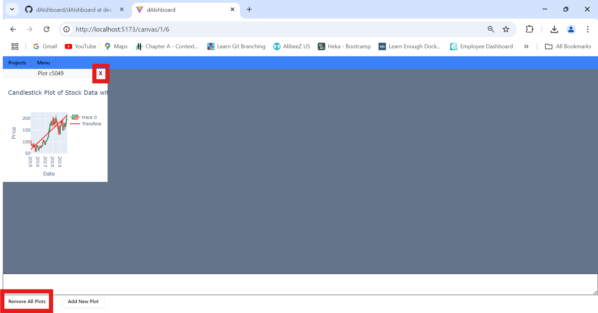

## Future Work <a name="fw"></a>
There are a few things we would have added to this project 
<font size="2">1. Better UI for Projects Page</font >
<font size="2">2. Better UI to display available data</font >
<font size="2">3. Add tables using plotly table</font >
<font size="2">4. Add ability to change the LLM model we use (We already use langchain so this should be easy to setup)</font >